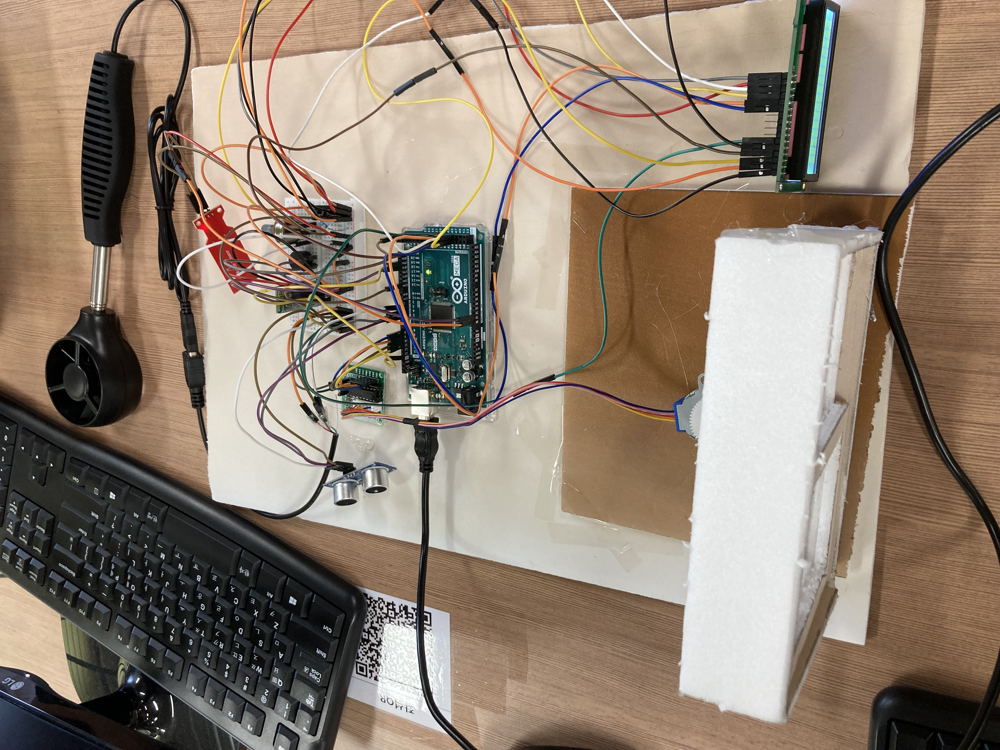

# Smart Window IoT System

> **Note:** This project was developed as a term project for the **Adventure Design** course at Pusan National University (2nd Semester, 2023).

## 📺 시현 영상 (Demo Video)
[](https://youtu.be/lpE6I9GTra0)

## 📌 개요 (Overview)
- **과목명:** 어드벤처디자인 (Adventure Design)
- **개발 기간:** 2023.12 (약 1개월)
- **프로젝트 유형:** IoT 기반 자동 창문 제어 시스템
- **목표:** 외부 환경을 감지해 창문을 자동 제어하고, 안드로이드 앱으로 원격 제어

## 🏗 시스템 구조 (Architecture)
1. 안드로이드 앱이 블루투스로 제어 명령 전송
2. HC-06 블루투스 모듈이 아두이노 메가 2560으로 명령 전달
3. 아두이노가 센서값(초음파/수위/풍속/온도)을 기반으로 창문 개폐 판단
4. 스텝모터(ULN2003 드라이버)가 기어/랙을 통해 창문을 여닫음

## 📷 보드 연결 사진


## 🛠 기술 스택 (Tech Stack)
- Firmware: Arduino C/C++
- Board: Arduino Mega 2560
- Libraries: `Stepper`, `FreqPeriodCounter`, `LiquidCrystal`, `pitches`
- Communication: Bluetooth Serial (`Serial1`)

## 📦 사용 기자재 (모델명)
- Arduino Mega 2560
- HC-06 Bluetooth Serial Module
- HC-SR04 초음파 센서
- SZH-EK057 수위 센서 모듈
- 5V 스텝모터 + ULN2003 드라이버 모듈
- 풍속 센서(아날로그 출력 타입)
- 온도 센서(아날로그 출력 타입)
- 16x2 LCD
- 스피커(부저)

## 🗂 디렉토리 구조
```text
/SmartWindow-IoT-System
  ├── assets/
  │   └── images/
  │       └── smart_window.jpg
  ├── firmware/
  │   └── smart_window_controller/
  │       └── smart_window_controller.ino
  └── README.md
```

## 🔑 핵심 기능 (Key Features)
- 초음파 감지 시 경보음 재생 후 자동 닫힘
- 수위/풍속 임계값 초과 시 자동 닫힘
- 버튼 수동 제어 및 블루투스 원격 제어(`O`/`C`)
- LCD에 온도/풍속 실시간 출력

## 🚀 실행 방법 (How to Run)
1. Arduino IDE에서 `firmware/smart_window_controller/smart_window_controller.ino`를 엽니다.
2. 보드와 포트를 설정합니다.
3. 필요한 라이브러리를 설치합니다.
4. 업로드 후 시리얼 모니터(9600 baud)와 블루투스로 동작 확인합니다.
